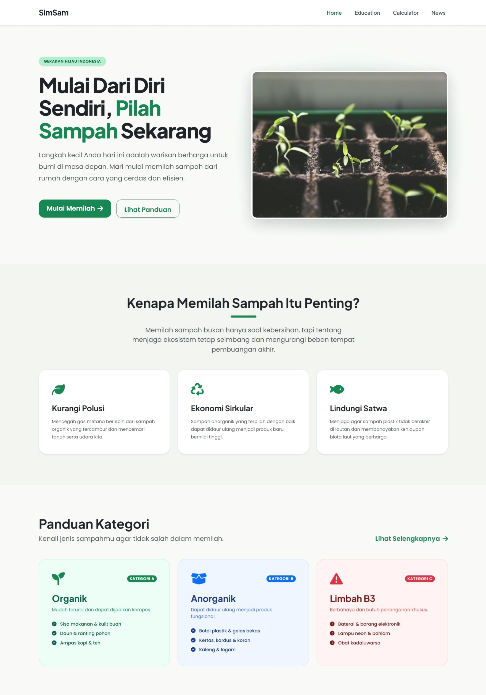

# 🌱 Digital Waste Management Website

Website edukasi dan tools pengelolaan sampah berbasis web untuk membantu masyarakat memilah sampah, menemukan lokasi bank sampah, dan menghitung nilai ekonominya.

---

## 📸 Preview



---

## 📖 About The Project

Project ini dibuat untuk membantu masyarakat dalam:

- Memahami kategori sampah dan cara pengelolaannya
- Menemukan lokasi bank sampah terdekat
- Menghitung potensi nilai ekonomi dari sampah
- Mendapatkan berita lingkungan terbaru

---

## 🚀 Features

- Edukasi kategori sampah  
- Recycle Locator  
- Waste Calculator  
- Environmental News API  

---

## 🛠️ Built With

- HTML  
- CSS  
- Bootstrap  
- JavaScript (Vanilla)  
---

## 📂 Project Structure

```
Manajemen-Sampah-Digital
│
├── frontend
├── backend
```

---

## ⚙️ Getting Started

### Clone Repository
```sh
git clone https://github.com/Lordsans-404/Manajemen-Sampah-Digital.git
```
---

## 👥 Team Members
  
- FE: Daria, Zachra  
- BE: Sarahh  
- Creative: Ridho, Akmal  
